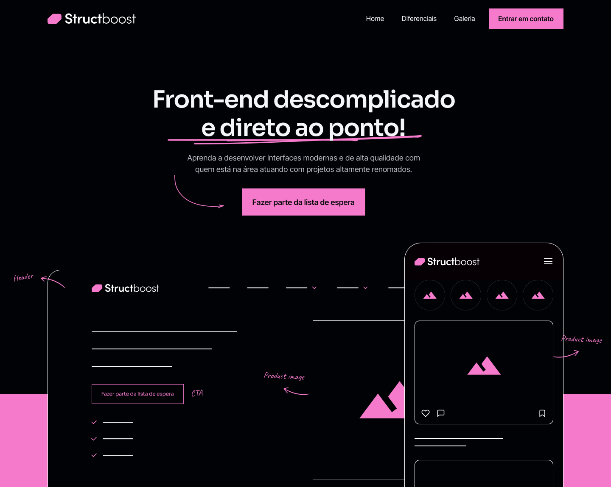

<h1 align="center"> Structboost </h1>

Estudos de Front-End - 1º projeto.

  <a href="#-tecnologias">Tecnologias</a>&nbsp;&nbsp;&nbsp;|&nbsp;&nbsp;&nbsp;
  <a href="#-projeto">Projeto</a>

 

  

## 🚀 Tecnologias

Esse projeto foi desenvolvido com as seguintes tecnologias:

- Figma
- HTML e CSS
- Git e Github

## 💻 Projeto

O Structboost é um projeto que visa a estruturação de uma página, com destaque para posicionamentos utilizando flex e grid. Além de seguir um passo a passo estruturado, tornando o desenvolvimento muito simples e ágil.
O projeto é responsivo e conta com pequenas animações para dar um toque especial.

- [Acesse o projeto finalizado, online](https://quymcode.github.io/structboost/)